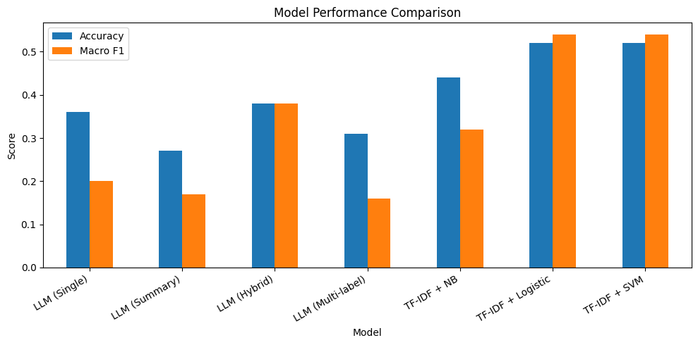
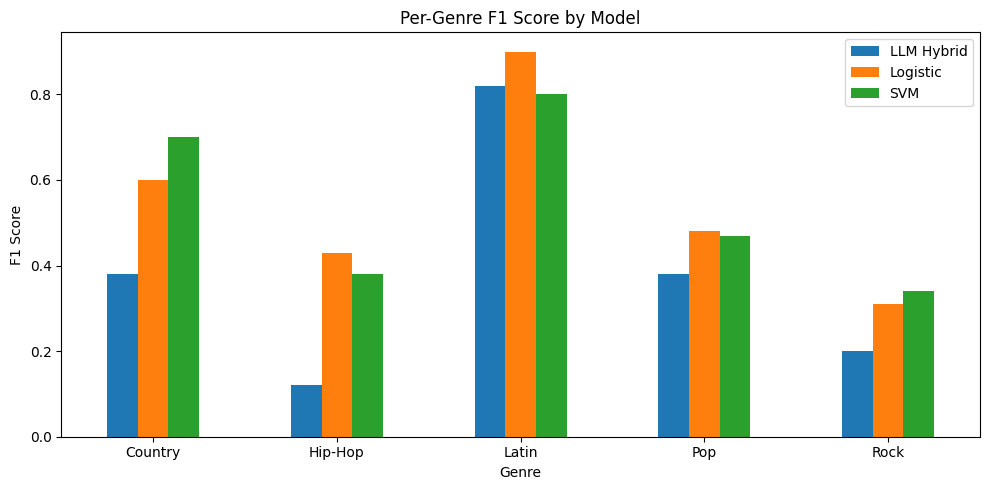
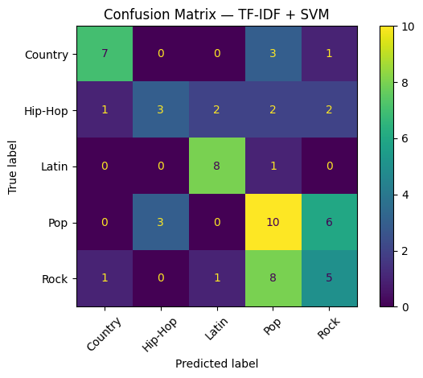
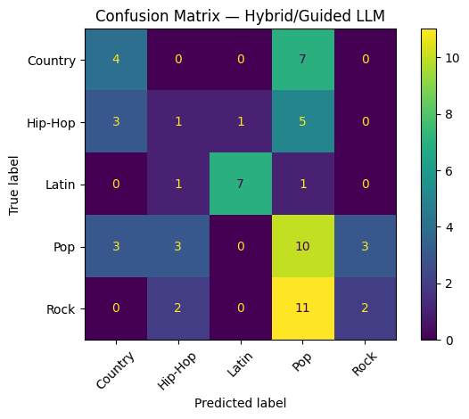

## Project Summary

This project explores the problem of **music genre classification using song lyrics**, comparing traditional supervised machine learning approaches with large language model (LLM)–based methods. The goal was to evaluate whether modern LLMs can match or exceed classical text classification pipelines when applied to a real-world, moderately sized dataset.

The dataset consists of popular songs enriched with lyrical content and genre labels derived from external music metadata sources. After preprocessing and filtering underrepresented genres, the final dataset focused on five major genres: **Pop, Rock, Country, Hip-Hop, and Latin**.

---

## Methodology Overview

Three primary modeling strategies were evaluated:

### 1. Traditional Supervised Learning (Baseline Models)
Lyrics were vectorized using **TF-IDF**, and the following classifiers were trained and evaluated:
- Logistic Regression
- Support Vector Machines (SVM)
- Multinomial Naive Bayes

These models serve as strong, interpretable baselines commonly used in text classification tasks.

---

### 2. Large Language Model (LLM) Approaches
Multiple LLM-based classification strategies were tested using a locally executed transformer model:
- **Single-pass zero-shot classification**
- **Summarization-based classification**
- **Hybrid approach** (summarization followed by classification)
- **Multi-label prompting**

LLMs were evaluated in a strictly local execution context, with no downstream training or data retention.

---

### 3. Hybrid & Comparative Evaluation
Model performance was evaluated using:
- **Accuracy**
- **Macro-averaged F1 score**, to account for class imbalance

Results were analyzed at both the **overall model level** and the **per-genre level**.

---

## Results Summary

Traditional TF-IDF–based models consistently outperformed LLM-only approaches on this dataset. In particular:

- **TF-IDF + Logistic Regression** and **TF-IDF + SVM** achieved the highest overall performance
- LLM-based models showed competitive performance for certain genres (notably *Latin*) but struggled with consistency across all classes
- The hybrid LLM approach improved performance relative to single-pass prompting, but still fell short of supervised models

These findings highlight that **classical machine learning remains highly effective for lyric-based genre classification**, especially when labeled data is available.

---

## Visualizations & Analysis

### Overall Model Comparison

---

### Per-Genre Performance Breakdown

---

### Confusion Matrices

---

## Key Takeaways

- Classical TF-IDF–based models remain strong baselines for lyric classification
- LLMs demonstrate semantic understanding but are sensitive to prompt design and sequence length
- Hybrid approaches improve LLM performance but do not yet surpass supervised models
- Genre-specific linguistic patterns strongly influence classification success

---

## Future Work

Potential extensions of this project include:
- Fine-tuning transformer models on labeled lyric datasets
- Incorporating audio features alongside lyrics
- Ensemble methods combining LLM outputs with supervised classifiers
- Expanding the genre taxonomy and dataset size

---

## Ethical & Legal Considerations

This project uses song lyrics solely for non-commercial, educational analysis. Lyrics are not redistributed, published, or regenerated by any model.

All models operate on transformed text representations (e.g., TF-IDF features or summarized descriptions), and their outputs are limited to genre labels.

All large language models in this project were executed locally using pretrained weights. 

No fine-tuning or gradient updates were performed, and no input data was transmitted to third-party APIs or external servers. 

As a result, copyrighted song lyrics were not retained, logged, or reused for future model training. This local inference approach ensures that all analysis remains isolated within the project environment and does not contribute to training downstream models.
